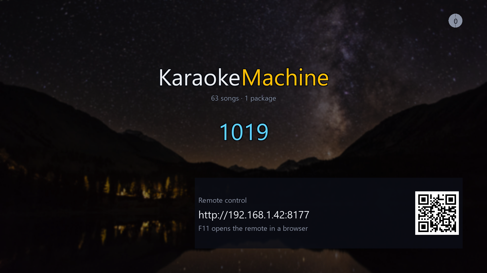
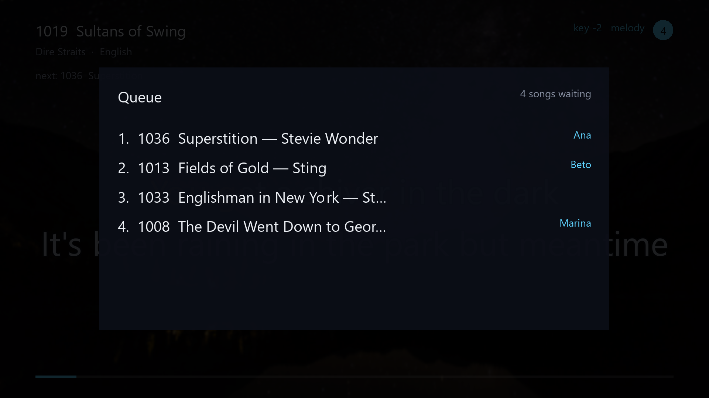
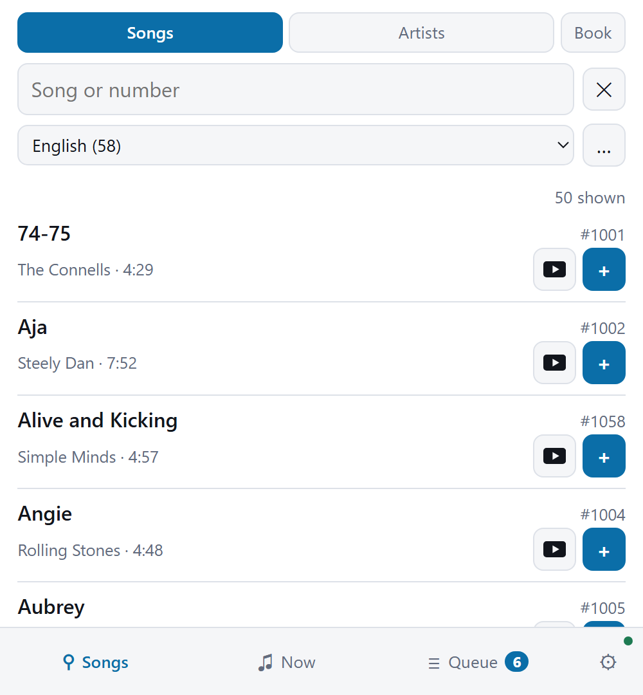
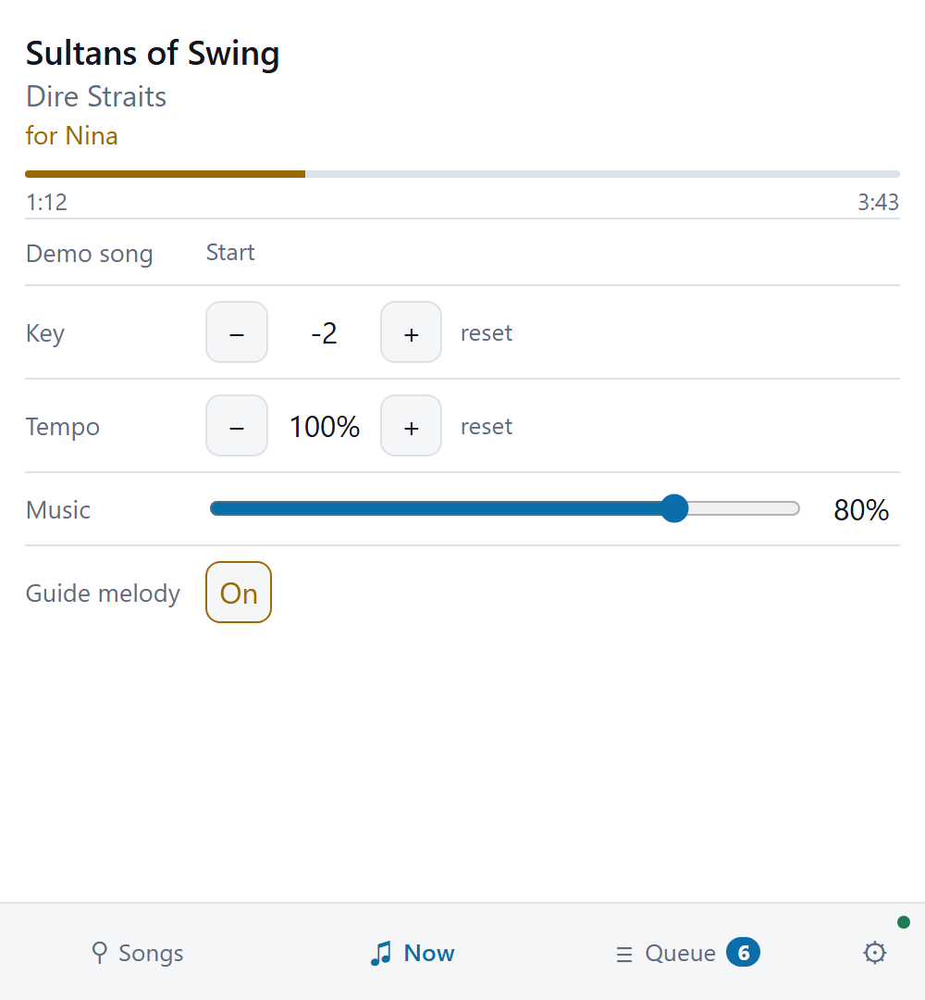
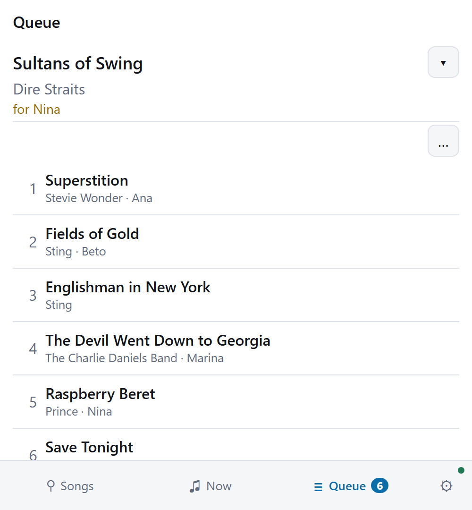
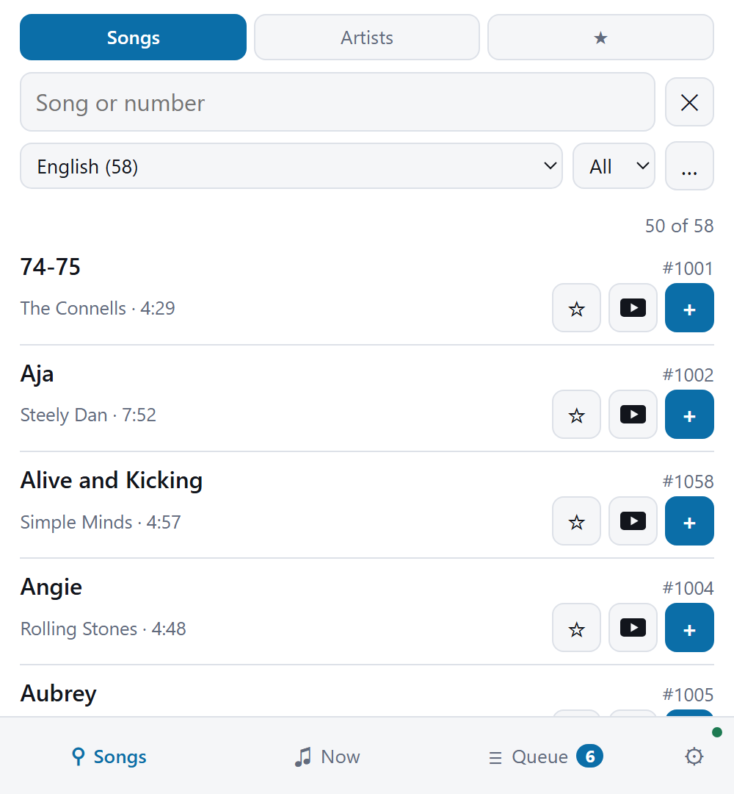
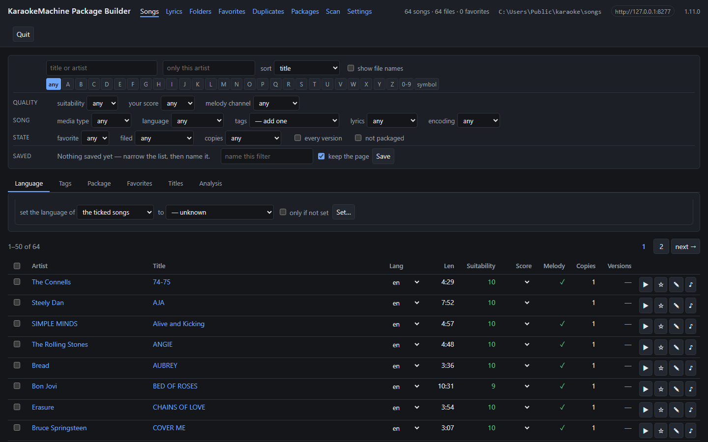

<h1>
  
  KaraokeMachine
</h1>

A karaoke machine that behaves like a commercial home unit: pick a song by number, it plays, and the
words highlight in time. It runs full-screen on a television, and any phone on the network is a
remote: search the catalog, queue a song, change the key, skip.

A song is one of five things:

- a **MIDI file with embedded karaoke lyrics**;
- a **video file**;
- an **MP3+G pair**: an MP3 with a `.cdg` of the same stem beside it;
- an **UltraStar song**: the `.txt` a singing game times its words in, and the MP3 it names;
- an **LRC song**: an `.lrc` of timed lyrics, and the MP3 of the same name.

An MP3 on its own is not a song, because it has no words in it.

It runs on Windows, macOS and Linux, on Android and a Meta Quest, and on an iPhone and an iPad. The
pictures and the download are on the site,
**[rrgmc.github.io/karaokemachine](https://rrgmc.github.io/karaokemachine/)**.

## Contents

- [What it looks like](#what-it-looks-like)
- [What it does](#what-it-does)
- [Installing](#installing)
  - [On Debian, it is also an appliance — if you ask](#on-debian-it-is-also-an-appliance--if-you-ask)
  - [On an iPhone or an iPad, you sign it yourself](#on-an-iphone-or-an-ipad-you-sign-it-yourself)
  - [Removing it](#removing-it)
- [Using it](#using-it)
  - [The keyboard](#the-keyboard)
  - [Getting songs in](#getting-songs-in)
  - [The remotes](#the-remotes)
  - [Watching it in another room](#watching-it-in-another-room)
  - [Setting it up from a browser](#setting-it-up-from-a-browser)
  - [The song book](#the-song-book)
- [For a technical reader](#for-a-technical-reader)
  - [The command line](#the-command-line)
  - [Song files and their formats](#song-files-and-their-formats)
  - [Text encodings and writing systems](#text-encodings-and-writing-systems)
  - [The HTTP API and the network](#the-http-api-and-the-network)
  - [Getting a corpus into shape](#getting-a-corpus-into-shape)
- [Documentation](#documentation)
- [License](#license)
- [Author](#author)

---

## What it looks like


<table>
<tr>
<td width="50%"></td>
<td width="50%"></td>
</tr>
<tr>
<td><sub><b>Idle.</b> Type a number, or point a phone at the code.</sub></td>
<td><sub><b>The queue.</b> What is waiting, and who asked for it.</sub></td>
</tr>
</table>


<sub><b>Singing.</b> Each syllable fills in time with the music, and the next line is already
waiting.</sub>

<table>
<tr>
<td width="25%"></td>
<td width="25%"></td>
<td width="25%"></td>
<td width="25%"></td>
</tr>
<tr>
<td><sub><b>Search and queue</b> from any phone. No app to install.</sub></td>
<td><sub><b>The song as it plays</b> — key, tempo, guide melody, music volume.</sub></td>
<td><sub><b>Who is up next</b>, changeable by anyone. The controls stay folded until asked
for.</sub></td>
<td><sub><b>The offline remote</b> adds favorites and an A–Z picker, and works with the machine
switched off.</sub></td>
</tr>
</table>

---

## What it does

**Songs**

- **Songs arrive in packages** (`.kmpkg`). Each one carries its own queue numbers, titles, artists
  and analysis, and it goes in without a restart.
- **A language per song**, so a catalog can say what Portuguese it has.
- **A 0–10 suitability rating** for every file, with a breakdown.
- **The melody channel, where the machine can find it with confidence**, and a stated reason where
  it cannot.
- **The first line or two of each song's words**, so a person can recognize the song. The machine
  skips the studio-name banner that many karaoke files open with.

**Playing**

- Full-screen on a television, drawn by SDL3. On Linux it draws straight to DRM/KMS from a bare TTY,
  with no desktop installed.
- **Or on a television in another room**, as a stream a browser or a playlist player opens. See
  [Watching it in another room](#watching-it-in-another-room).
- **Words highlight in time**, syllable by syllable, on the sequencer's own clock.
- **Transpose and tempo** per song, a **guide melody** that can be muted, and per-song defaults.
- **A lyric timing offset in milliseconds**, adjustable mid-song, for the picture lag of a
  television. It moves the highlight only and never the audio, because the microphones are in that
  audio.
- **Wallpapers** cycling with a crossfade, from a folder of stills or a zip of them.
- **A queue** with singer names, shown over whatever is playing.
- **A demo mode**, off by default: after a minute of quiet the machine plays songs by itself until
  somebody queues one.

**Remotes**

- **The machine serves a remote at its own address.** Any phone on the network reaches it, with no
  app to install.
- **A standalone offline remote** keeps its own copy of a machine's catalog, and works with the
  machine switched off.
- **One admin password, which the machine shows on its own screen.** Everything that reconfigures
  the machine needs it, and nothing a singer does needs it.

**Giving the machine pictures and instruments**

- **KaraokeMachine Admin** (`km-admin`) finds photographs the lyrics stay readable over. It also
  offers General MIDI banks from a table of sixty-three. It sends either to the machine, and it sends
  a package, a bank or a photograph of your own.
- **The machine downloads none of these itself**, because it may have no internet and should not hold
  your accounts. `km-admin` keeps a copy of every download, to send to the machine later.
- **Pictures come from Openverse by default.** Openverse needs no account, and its packs may travel
  on. Pixabay and Pexels need an API key of your own, and their terms forbid that.

**Not supported, by decision**

- No scoring of singers.
- No bare audio files, and no CD+G disc images — only the file pair.
- No video wallpapers: a video song is not a video background.
- No pitch shifting of audio.
- No microphone processing in the app, because hardware mixes the microphones.
- No Thai, Arabic or Indic words on the screen, and no right-to-left, though the machine draws
  Japanese and Chinese.

Each of these is a decision with a reason. To propose a change, start with
[`docs/decisions/`](docs/decisions/).

---

## Installing

**The downloads are on the [release page](https://github.com/rrgmc/karaokemachine/releases)**, one
file per platform. The carol package is a separate download beside them. To build from source, see
[`BUILDING.md`](BUILDING.md).

| Platform | What you get |
|---|---|
| **Windows** | A setup program, `karaokemachine-setup-<version>-windows-x86_64.exe`, with all eight products behind component checkboxes. It installs **per-user** into `%LOCALAPPDATA%\Programs` with no UAC prompt, and offers to add itself to `PATH` and to open `.kmbuild` files. Or a **portable folder**: unzip and run. |
| **macOS** | An installer package, `karaokemachine-setup-<version>-macos-<arch>.pkg`, with the same eight products. Applications go to `/Applications`, and command-line tools to `/usr/local/karaokemachine` with symlinks in `/usr/local/bin`. It asks for your administrator password once. Or `Karaoke Machine.app` on its own. |
| **Windows or macOS, the remote alone** | `km-remote-setup-<version>-windows-x86_64.exe` or `km-remote-setup-<version>-macos-<arch>.pkg`. It installs KM Remote only, for a computer that never plays a song. It can stay beside a full install. |
| **Debian, Ubuntu** | A `.deb` that names its ffmpeg and font dependencies. It installs a menu entry, an icon and the `karaokemachine` command, plus the appliance service, switched off. A second `.deb`, `karaokemachine-tools`, holds the two package builders, the offline remote and the picture-and-bank tool. Name both files in one `apt install` to get both. |
| **Any Linux** | A `.tar.gz`. Unpack it anywhere and run it, with no root and no package manager. It carries its own ffmpeg. |
| **Android, Google TV** | An APK carrying both ABIs, for a phone and for a television. |
| **Meta Quest** | An APK of its own, which puts the machine on a flat or curved screen in the room. The Android APK also installs, as a flat panel you move and resize. |
| **iPhone, iPad** | An `.ipa` for the machine and one for the remote, both **unsigned**. You sign them yourself with your own Apple ID. |

**Every install also has a second launcher, which starts the machine streaming.** See
[Watching it in another room](#watching-it-in-another-room).

### On Debian, it is also an appliance — if you ask

**The `.deb` includes a systemd service, switched off by default.** Enable it, and the computer
becomes an appliance. It starts when the power returns, and it draws from a bare virtual terminal
with no desktop installed.

```sh
sudo systemctl enable --now karaokemachine
```

`sudo systemctl disable --now karaokemachine` turns it off again.

- **Do it on a machine with no desktop**, not on your laptop. The service takes over `tty1`. A login
  screen such as GDM, LightDM or SDDM holds the graphics device, and the television stays black.
- **It runs as a system user, `karaoke`**, so its songs, settings and catalog live under
  `/var/lib/karaoke`. Packages go in `/var/lib/karaoke/.local/share/karaokemachine/packages`.
  `sudo systemctl status karaokemachine` says whether it runs, and `sudo journalctl -t karaokemachine`
  says what happened.

### On an iPhone or an iPad, you sign it yourself

**iOS installs an application only under a signature, and Apple issues none that a stranger can give
you.** So both `.ipa` files say `unsigned` in the name, and you do the last step. It takes about five
minutes and a computer, once per app.

You need an Apple ID, and the one on the phone is fine. You also need a free signing tool:
**[Sideloadly](https://sideloadly.io)** on macOS or Windows, or **[AltStore](https://altstore.io)**.

1. Download `karaokemachine-<version>-ios-unsigned.ipa`, or
   `km-remote-<version>-ios-unsigned.ipa` for the remote alone.
2. Connect the phone or the iPad to the computer and unlock it.
3. Open Sideloadly, drag the `.ipa` onto it, enter your Apple ID and press **Start**. It signs the
   app for your devices and installs it.
4. On the device, open **Settings → General → VPN & Device Management**, tap your Apple ID under
   *Developer App*, and tap **Trust**. The app does not open until you do.
5. Start it once with the network available. iOS verifies the certificate on that first run.

Four limits come from Apple rather than from the application:

- **A free Apple ID signs for seven days.** After that the app does not open until you repeat step 3.
  Your songs, settings and catalog stay on the device. A paid developer account signs for a year, and
  AltStore renews in the background.
- **A free Apple ID signs three applications at a time.** The machine and the remote are two of them.
- **The machine does not announce itself on the network**, because Apple grants the multicast
  entitlement only after review. The iOS remote finds it anyway. The Android remote and a browser need
  the address from the idle screen.
- **An idle machine stops answering in the background**, because iOS suspends an app that plays no
  audio. A song that plays keeps playing with the screen off.

**Most people want the remote.** It is small, the last two limits do not apply to it, and it is what a
guest holds.

### Removing it

**Your songs, settings and catalog stay where they are**, and the uninstaller names their folders.

- **Windows**: uninstall as you do anything else. The remote alone is its own entry, **KM Remote**.
- **macOS**: open `/usr/local/karaokemachine` and double-click **Uninstall KaraokeMachine**. It lists
  what it removes, asks, and then asks for your password. From a terminal, run
  `sudo /usr/local/karaokemachine/uninstall.sh`, with `--dry-run` for the list alone. The remote alone
  has `/usr/local/km-remote` and **Uninstall KM Remote**.
- **Debian**: `sudo apt remove karaokemachine`, which stops and disables the appliance service first.
  `/var/lib/karaoke` stays even on a `purge`, and `sudo userdel -r karaoke` removes it.
- **Any Linux**: delete the folder. If you ran its `install.sh` for a menu entry,
  `./install.sh --uninstall` removes that entry.

Removing the machine leaves the remote alone, and removing the remote leaves the machine alone.

---

## Using it

Start it, type a song number, and it plays. The screen shows the words, and a phone does everything
else.

### The keyboard

Mid-song, a key press shows a strip of buttons along the bottom. **Each button names its function
key.** The function keys work without the strip, and each has a letter key that does the same.

| Key | Letter key | What it does |
|---|---|---|
| `F1` | `Space` | Pause and resume |
| `F2` | `,` | Go back ten seconds |
| `F3` | `.` | Go forward ten seconds |
| `F4` | `N` | Skip to the next song |
| `F5` | `R` | Start the song again |
| `F6` | `Q` | Show the queue |
| `F7` | `-` | Lower the key |
| `F8` | `+` | Raise the key |
| `F9` | `M` | Turn the guide melody on and off, for a song that has one |
| | `W` | Show the next wallpaper |
| | `I` | Show the address and QR code |
| | `F` | Fill the screen |
| | `T` | Keep the window in front of everything else |
| | `D` | Turn demo mode on and off |
| `0`–`9` | | Type a song number, on the number row or the keypad |
| `Enter` | | Queue the song number |
| `Backspace` | | Correct the song number |
| `Delete` | | Clear the song number |
| `F10` | | Open the packages folder |
| `Ctrl+F10` | | Read the packages folder again |
| `F11`, or `Ctrl+F11` on a Mac | | Open the remote in this computer's browser |
| `F12` | | Show how the picture is doing |
| `Ctrl+F12` | | Stop the strip of buttons timing out |
| `Ctrl+Q` | | Stop the machine |

**`T`** is for a machine that shares a screen with other windows. The machine remembers the setting.
Some Linux desktops do not let an application place itself, and there the key does nothing.

**`D`** starts a song at once and then plays songs by itself. If a song plays or waits in the
queue, demo mode takes over when the queue is empty. Turning it off lets the current song finish. It
lasts until the machine closes, and the `/admin/` page makes it permanent. With it on, `N` on a quiet
machine starts the next song.

**`Ctrl+F10`** lets a package you just copied in play without a restart.

**`F11`** opens the page a phone gets. macOS keeps `F11` for itself, and the panel names the key
that works on this computer.

**`F12`** shows frames a second, the time each frame took, and any sound or video that ran short. It
writes nothing to the log. The machine forgets `F12` and `Ctrl+F12` when it closes.

**`Ctrl+Q`** closes the application. On the Linux appliance it switches the box off, as its power
button does.

A television or a phone shows the same buttons without the key hints.

### Getting songs in

**Songs arrive in packages.** A `.kmpkg` is one file that carries its songs, queue numbers, titles,
artists and analysis. Videos and MP3+G pairs travel inside it.

**Double-click the package**, and the machine installs it and says so. The Windows installer offers
to set this up, and macOS does it when it installs the app. On Linux and for the portable Windows
folder, run `karaokemachine --register` once. Neither needs administrator rights.

**Or drag the file onto the machine's window.** It shows `installing …`, then how many songs went in.
A rebuilt package of the same name replaces the old one.

Either way the file goes into the packages folder, so it survives a restart. You can also copy the
file into that folder yourself, or send it through [the API](#the-http-api-and-the-network).

**The packages folder says which packages are installed.** Take a package out, and the machine
uninstalls it at the next start or the next `Ctrl+F10`. Removing a package on the **Songs** page
deletes its `.kmpkg`.

**One package is available to download: sixteen Christmas carols.** Every one is public domain, and
no install carries it, because you supply your own songs. A karaoke MIDI is rarely free to
distribute, because the tune, the arrangement and the words each have an owner. `CREDITS.md` beside
the pack names every source.

**A package holds at most 999 songs.** The limit is there to encourage a curated volume. The machine
holds up to a thousand packages.

**A song's number is `bank × 1000 + slot`.** The slot is the number the package gave the song, and
the bank is the block of a thousand the package sits in. Two packages that both number a song 500 do
not clash: one is 3500, the other 611500.

**A package's bank comes from its id, so its numbers are the same on every machine.** A printed song
list therefore travels with the file. If another package holds that bank, the package takes the next
one.

**You can choose a block**, from 1 to 9999, because bank 0 belongs to the machine. Put the volume you
sing from most into a low block, and its songs take four digits instead of six. The **Songs** page at
`http://127.0.0.1:8177/admin/` has a box for it.

A change renumbers every song in that package, so **a printed list becomes wrong**. The machine
refuses while a song of the package plays or waits in the queue. Do it once, when the package goes
in.

To make a package from a folder of your own files, see
[Getting a corpus into shape](#getting-a-corpus-into-shape).

### The remotes

**The machine serves a remote at its own address**, and any phone on the network opens it. Search the
catalog, queue a song, see what plays, and use the controls the song allows. The idle screen shows the
address and a QR code, so nobody types an IP address.

**The offline remote is a separate program**, `km-remote`. It keeps its own copy of a machine's
catalog, so browsing, searching and favorites work **with the machine switched off**. It finds a
machine on the network and remembers it, and it adds favorites and an A–Z picker. It has its own
download on every platform it runs on.

### Watching it in another room

**`--stream` sends the screen to an encoder instead of a television.** The machine opens no window. It
serves the picture and the sound as one continuous HLS stream. The flag applies to one run only, and
the machine refuses it together with `--headless`.

**Any player that follows a URL plays `http://<the machine>/stream/live.m3u8`**: a television's own
player, VLC, Kodi or a set-top box. `http://<the machine>/watch/` shows the same stream on a page. A
machine that does not stream serves neither.

**A launcher starts the stream with nothing to type.** It is a Start Menu entry on Windows, an action
in the Linux desktop menu, and `KM Stream.app` on macOS. Its icon has a broadcast badge in the corner.

**A streaming run shows an icon in the notification area on Windows and in the menu bar on macOS.**
The icon names the address a phone can reach. Its *Remote*, *Watch* and *Setup* entries open the three
pages the machine serves. It follows the address as the network changes.

**The stream costs two things.** It runs several seconds behind, so a pause lets the music continue
for the length of the buffer. It also carries only the backing track, because the microphones go to a
hardware mixer and never reach the machine.

### Setting it up from a browser

**The machine's address plus `/admin`** is the page for the owner of the machine. It has five tabs:

* **This machine**: its name, where to reach it, the password, demo mode and the screen language. It
  can also sign out every phone and browser at once, and turn debugging on and off.
* **Songs**: the installed packages, how many songs each holds, and the thousand its numbers sit in.
  Add or remove a package here.
* **Pictures**: the pictures in the rotation, the one that shows, and a way to add more. Your own
  pictures replace the ones that came with the machine.
* **Sound**: the sound banks, the one that plays, the audio output, and a way to add a `.sf2`.
* **Problems**: packages the machine could not load, and anything else that is wrong, each with the
  control that fixes it. The tab shows a count.

The remote links to this page at the foot of its Setup tab.

**The machine shows the password on its own screen.** It generates a six-digit PIN at first start
and shows it beside its address. Anyone in the room can read it, and nobody outside can. Change it on
the *This machine* tab, which every tab links to until you do.

The singer's remote offers only search, queue, and the controls a song allows. Nothing on it can
delete songs.

### The song book

**The song book is a printable PDF of every installed song.** It has four columns: artist, number,
title and first line. It sorts by artist, with a section per language. It reads the catalog, so start
the machine once after you add a package. `--book-name` sets the heading, and the default is
`KaraokeMachine`.

```sh
karaokemachine --song-book ./songbook.pdf
karaokemachine --song-book ./songbook.pdf --book-name "Sitting room"
```

---

## For a technical reader

This part covers the flags, the song file formats, the API, discovery on the network, and the tools
that make a package. [`BUILDING.md`](BUILDING.md) covers compiling.

### The command line

```sh
karaokemachine --show-paths              # settings, catalog, packages folder, assets
karaokemachine --set-password hunter2    # change the admin password (or the /admin page, or the API)
karaokemachine --reset-password          # back to a fresh PIN, shown on the machine's screen
karaokemachine --reset-sessions          # sign every phone and browser out at once
karaokemachine --set-name "Living Room"  # what phones call this machine on the network
                                         # (or set it at http://<the machine>/admin)
karaokemachine vol1.kmpkg                # install a package (what a double-click does)
karaokemachine --register                # make .kmpkg files open with this machine
karaokemachine --unregister              # ...and take that back off
karaokemachine --list-audio-devices      # output devices and their stable ids
karaokemachine --song-book ./songbook.pdf   # every installed song, as a PDF to print
karaokemachine --headless                # no window: API + engine + catalog
karaokemachine --stream                  # no window: the screen goes to http://<the machine>/watch/
karaokemachine --fullscreen              # fill the screen this run, whatever settings say
karaokemachine --windowed                # ...and open in a window instead
karaokemachine -v                        # say more; -vv for everything
karaokemachine --frame-stats             # fps, frame times and decode, once a second
karaokemachine --log-file                # also write this run's log to a file
```

**`--log-file` is for a run that went wrong.** A double-click opens no console, so the log has
nowhere else to go. It writes one file per run into a `logs` folder beside the catalog, and keeps the
ten newest.

**`--fullscreen` and `--windowed` apply to one run and write nothing down.** An installed machine
fills the screen, and one you built yourself opens in a window.

### Song files and their formats

- **MIDI and KAR**, in all three karaoke conventions: Soft Karaoke `@`-headers, `Lyric` meta-events,
  and a named text track.
- **A video song** is H.264 with AAC audio, in an MP4.
- **An MP3+G song** is an MP3 with a `.cdg` of the same stem. The machine draws the CD+G graphics
  itself, in Rust.
- **An UltraStar song** is a `.txt` beside the MP3 it names. The machine reads its timed words and
  discards its pitches.
- **An LRC song** is an `.lrc` beside the MP3 of the same name. A file that times each word gets the
  word wipe. A file that times only its lines lights a whole line at a time, and counts you back in
  after a break.
- **A song's language is an ISO 639-1 code.**

### Text encodings and writing systems

- **The machine detects a legacy encoding**: Shift-JIS and the Windows code pages.
- **CJK works**: a Japanese or Chinese song uses a font from the system.
- **No shaped scripts, and no right-to-left.** Thai, Arabic and Indic need a text shaper, and this
  build does not include one.

### The HTTP API and the network

- **An HTTP API with a WebSocket event stream** covers search, queue, transport, settings, packages,
  wallpapers, demo mode, microphones and audio output.
- **The URL prefix says which routes need the machine's password.** Everything that reconfigures the
  machine is under `/api/v1/admin/`.
- **mDNS finds the machine on the network**, and a `/discover` endpoint answers as well.
- **`POST /api/v1/admin/packages` installs a package without a restart.** Removing one through the
  API deletes its `.kmpkg`.
- **`GET /api/v1/songs/book.pdf` returns the song book**, and takes `?language=`, `?package=` and
  `?name=`. `km-pack book` prints one from `.kmpkg` files that no machine has installed.

To set [a package's bank](#getting-songs-in), log in first:

```sh
# Songs 1001-1999 instead of 611001-611999, for the volume that gets sung from.
TOKEN=$(curl -s -H 'content-type: application/json' -d '{"password": "<the machine password>"}' \
        http://127.0.0.1:8177/api/v1/admin/login | jq -r .token)
curl -X PUT -H "authorization: Bearer $TOKEN" -H 'content-type: application/json' \
     -d '{"bank": 1}' http://127.0.0.1:8177/api/v1/admin/packages/brasil/bank
```

### Getting a corpus into shape

<p align="center">

<br><sub><b>km-package-builder</b>, for getting a folder of files into shape before it is packaged.</sub>
</p>

**KM Simple Package, `km-package-simple`, makes a package from a folder in one step.** It is for
songs you want on the machine without curating them first. Choose the folder, rename a song or leave
it out, and build. Each package it writes is marked *uncurated*, and the machine's package lists
show the mark.

**Four more tools turn a folder of files into packages.** `km-package-builder` curates the folder,
`km-pack` builds and checks packages, and `km-lyrics` shows one file's parsed timeline.
`km-wallpaper-pack` builds a wallpaper set from pictures the lyrics stay readable over.

```sh
# Curation: a local web server at http://127.0.0.1:8178. Browse, search the lyrics themselves,
# rate, fix names, group duplicates, and pick songs into packages. Only `--init` creates the
# database, so a wrong folder is an error rather than an empty index.
km-package-builder ./songs --init --scan --open
km-package-builder ./songs                      # once it has a database

# Packaging: describe the folder, edit the description, build it. `build` takes a description and
# never a folder. A folder of more than 999 songs is refused: split it, or narrow it with the flags.
km-pack spec ./songs --out vol1.kmspec.yaml     # what is here, and what it is called
km-pack spec ./songs --out vol1.kmspec.yaml --min-suitability 6 --require-lyrics   # ...or be choosier
km-pack build vol1.kmspec.yaml                  # build what the description says
km-pack check vol1.kmpkg                        # validate + report suitability

# One file's parsed lyric timeline and analysis, when a song does not behave.
km-lyrics dump ./song.kar
```

---

## Documentation

| File | What it is |
|---|---|
| [`CHANGELOG.md`](CHANGELOG.md) | **What changed.** What a release gave you. |
| [`BUILDING.md`](BUILDING.md) | **Building it.** Prerequisites, the cargo aliases and the Taskfile, video, the release scripts and CI. |
| [`RELEASE.md`](RELEASE.md) | **Cutting a release.** The order the steps go in. |
| [`DEPLOYING.md`](DEPLOYING.md) | **Getting it onto a device.** Android and iOS, and a Linux box over SSH. |
| [`CONTRIBUTING.md`](CONTRIBUTING.md) | **Working on it.** What to run before a pull request, the conventions, and the invariants. |
| [`SECURITY.md`](SECURITY.md) | **Reporting a vulnerability.** Privately, through GitHub, and what counts as one. |
| [`CODE_OF_CONDUCT.md`](CODE_OF_CONDUCT.md) | **How people treat each other here.** The Contributor Covenant. |
| [`docs/decisions/`](docs/decisions/) | **Why it is the way it is.** Every product decision, in topic files, [indexed](docs/decisions/README.md). |
| [`docs/ARCHITECTURE.md`](docs/ARCHITECTURE.md) | **How it is built.** The overview and the crate map; [`docs/architecture/`](docs/architecture/) has a note per subsystem. |
| [`docs/research/`](docs/research/) | Investigations. Findings, not commitments. |
| [`docs/learning-rust.md`](docs/learning-rust.md) | What a C++ reader needs in order to read this codebase. |
| [`docs/HISTORY.md`](docs/HISTORY.md) | **Where it came from.** Five attempts at this machine over eighteen years, and where each one stopped. |
| [`CLAUDE.md`](CLAUDE.md) | Repository guide, and the rules those documents are kept under. |

## License

`MIT OR Apache-2.0`, at your option, as every crate in the workspace declares. The texts are
[`LICENSE-MIT`](LICENSE-MIT) and [`LICENSE-APACHE`](LICENSE-APACHE).

Unless you say otherwise, a contribution you deliberately submit falls under the same dual license,
with no additional terms.

**The license covers the application only.** A release carries the ffmpeg libraries under the LGPL,
with their terms in the folder that holds them. The instrument bank has its own license.

**The seven default wallpapers are CC0 photographs**, in `assets/wallpapers/default-wallpapers.zip`.
`CREDITS.md` beside the zip names each photographer and source page, and says how each image was
edited.

**No release includes a pack you build with
[`tools/cmd/assets/km-wallpaper-pack`](tools/cmd/assets/km-wallpaper-pack).** Only an Openverse pack
may travel on. A Pixabay or Pexels pack stays on the machine that built it, and `manifest.json`
records each image's license. See [`Where a wallpaper pack's photographs may come
from`](docs/decisions/repository.md#where-a-wallpaper-packs-photographs-may-come-from).

## Author

Rangel Reale (realerangel@gmail.com)
