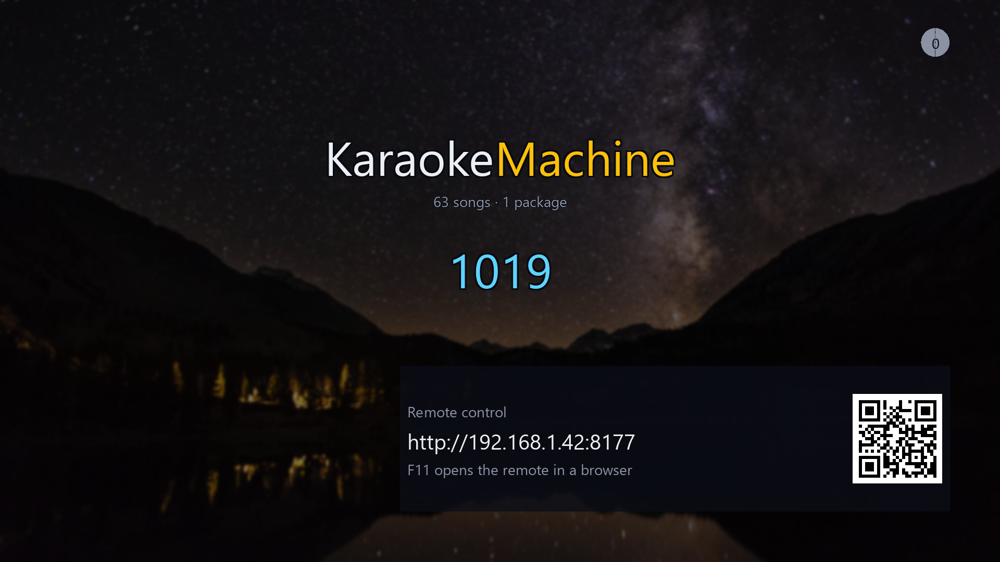
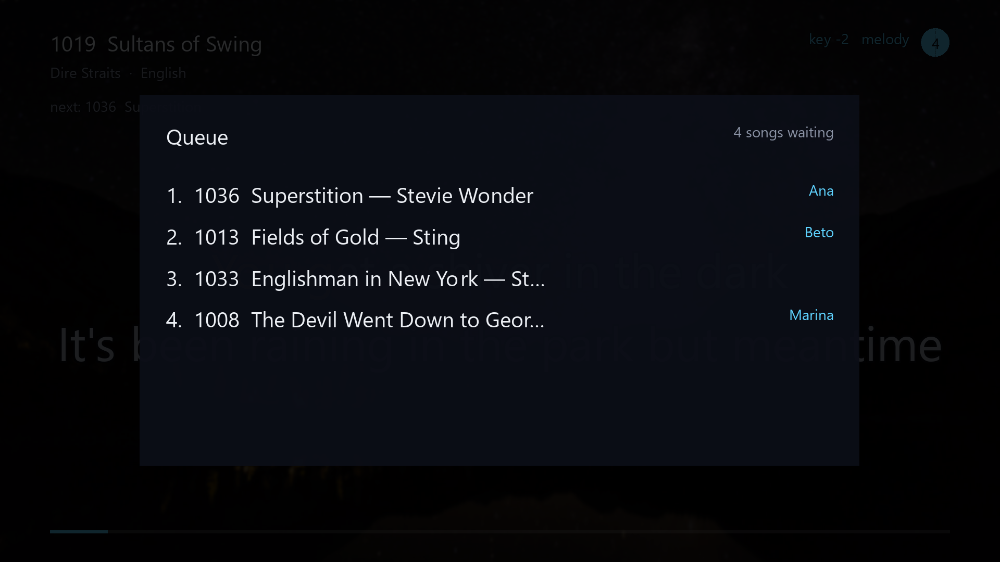

# The keyboard

Mid-song, a key press shows a strip of buttons along the bottom. **Each button names its function
key.** The function keys work without the strip, and each has a letter key that does the same.

| Key | Letter key | What it does |
|---|---|---|
| `F1` | `Space` | Pause and resume |
| `F2` | `,` | Go back ten seconds |
| `F3` | `.` | Go forward ten seconds |
| `F4` | `N` | Skip to the next song |
| `F5` | `R` | Start the song again |
| `F6` | `Q` | Show the queue |
| `F7` | `-` | Lower the key |
| `F8` | `+` | Raise the key |
| `F9` | `M` | Turn the guide melody on and off, for a song that has one |
| | `K` | Put the song back in its own key |
| | `W` | Show the next wallpaper |
| | `I` | Show the address and QR code |
| | `F` | Fill the screen |
| | `T` | Keep the window in front of everything else |
| | `D` | Turn demo mode on and off |
| `0`–`9` | | Type a song number, on the number row or the keypad |
| `Enter` | | Queue the song number |
| `Backspace` | | Correct the song number |
| `Delete` | | Clear the song number |
| `↑` `↓` `←` `→` | | Move around the on-screen number pad, where one is drawn |
| `Esc` | | Leave full screen. In a window, stop the machine |
| `Back`, on a TV remote or a phone | | Go back one step, and leave the machine from the first screen |
| `F10` | | Open the packages folder |
| `Ctrl+F10` | | Read the packages folder again |
| `F11`, or `Ctrl+F11` on a Mac | | Open the remote in this computer's browser |
| `F12` | | Show how the picture is doing |
| `Ctrl+F12` | | Stop the strip of buttons timing out |
| `Ctrl+Q` | | Stop the machine |
| `Ctrl+1`–`Ctrl+9` | | Change to another SoundFont bank that `debug.soundfonts` names, to compare them |

<table>
<tr>
<td width="50%"></td>
<td width="50%"></td>
</tr>
<tr>
<td><b>A song number, part typed.</b> <code>Enter</code> queues it, and <code>I</code> shows
the address and QR code.</td>
<td><b>The queue</b>, which <code>F6</code> or <code>Q</code> shows over the song.</td>
</tr>
</table>

**`T`** is for a machine that shares a screen with other windows. The machine remembers the setting.
Some Linux desktops do not let an application place itself, and there the key does nothing.

**`D`** starts a song at once and then plays songs by itself. If a song plays or waits in the
queue, demo mode takes over when the queue is empty. Turning it off lets the current song finish. It
lasts until the machine closes, and the `/admin/` page makes it permanent. With it on, `N` on a quiet
machine starts the next song.

**`Ctrl+F10`** lets a package you just copied in play without a restart.

**`F11`** opens the page a phone gets. macOS keeps `F11` for itself, and the panel names the key
that works on this computer.

**`F12`** shows frames a second, the time each frame took, and any sound or video that ran short. It
writes nothing to the log. The machine forgets `F12` and `Ctrl+F12` when it closes.

**`Ctrl+Q`** closes the application. On the Linux appliance it switches the box off, as its power
button does.

A television or a phone shows the same buttons without the key hints.
