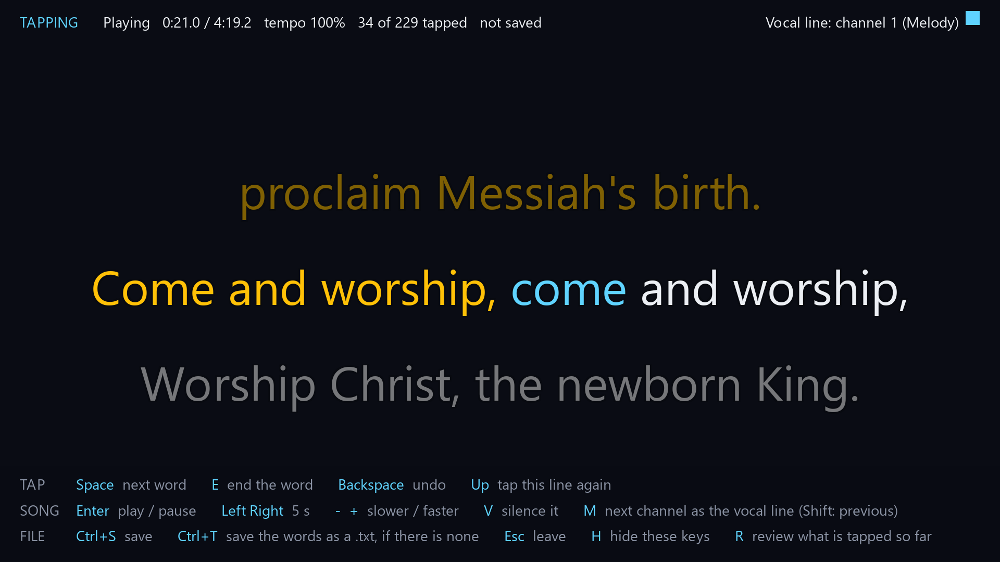
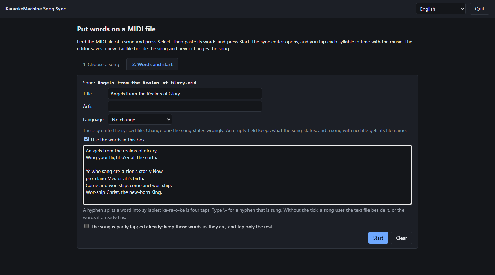

# Putting words on a MIDI file

A MIDI file with no words, or with words timed badly, gets them from the lyric sync editor. You
give it the song and the words as text, and you press Space as each word is sung. It writes a new
`.kar` file and never changes the MIDI file.

<p align="center">

<br><sub><b>The lyric sync editor.</b> Each press of Space gives the next word its time.</sub>
</p>

## Start the editor from a shell

```sh
karaokemachine --sync song.mid --sync-words words.txt     # writes song.kar beside the song
karaokemachine --sync song.kar                            # correct the words a file already has
karaokemachine --sync song.kar --sync-words words.txt --sync-continue   # go on from a part-tapped file
```

**A file that has words** opens in review when you give no words file, so you can fix its timing.
A file saved before every word was tapped goes on from the next word with `--sync-continue`. The
result of either is written to `song-synced.kar`, and `--sync-out` names another file.

## Start the editor from a page

**KM Song Sync, `km-song-sync`, starts the editor from a page.** On the first tab, browse to the
MIDI file and press Select. The second tab opens: paste the words into the box, and press Start.
The first tab lists folders and MIDI files only. The buttons under the path box open your home
folder, and on macOS your iCloud Drive and Dropbox folders.

With the box unticked it uses the text file beside the song, which has the song's name and
`.txt`, in any encoding. A song that has words already opens with them. A synced copy that is already there is replaced only
when you tick the box that says so.

**The page shows the title, the artist and the language of the selected song.** Change any of them,
and the synced file holds what you entered. An empty field keeps what the song states. A song with
no title gets its file name.

<p align="center">

<br><sub><b>KM Song Sync</b>, with a song selected and its words pasted.</sub>
</p>

## Write the words file

The words file is plain text. One line is one line on screen, and an empty line starts a new
page. A hyphen splits a word into syllables, so `ka-ra-o-ke` is tapped four times. Type `\-` for a
hyphen that belongs to the word.

## Tap the words

Tapping gives each word its time. Enter plays and pauses, Space marks the next word, and
Backspace takes back the last one. `E` ends a word before a pause, so its highlight stops there.

## Review the timing

Review plays the song with your words as the machine will draw them. `R` opens it. A banner says
so when the last word is tapped, and `R` also opens it earlier.

The arrow keys select a word and move it by 10 ms.
`C` selects the word being sung. Ctrl+Shift+Backspace clears every tap, so you tap from the
first word again. The same keys give the taps back until you tap a word.

## Find the vocal line

The vocal line is the channel that plays the sung tune. The editor finds it from your taps,
and `M` changes it. `V` silences it, so you hear whether the tune is gone. `N` moves your words
onto its notes. The top right corner says the editor is detecting it while a word is untapped. It
says none was found only when every word is tapped.

**A bar under the status line counts in to a line of the words.** It fills while the vocal line is
silent, and it is full as the vocal line comes in. It is the bar the machine draws before a line
after a long pause.

## Save the result

The key list at the foot of the window names every key, and `H` hides it. Ctrl+S saves. Ctrl+T writes
the words as a `.txt` beside the song, when no such file is there. The editor
uses the machine's instrument bank, audio device and language, and writes no settings.
