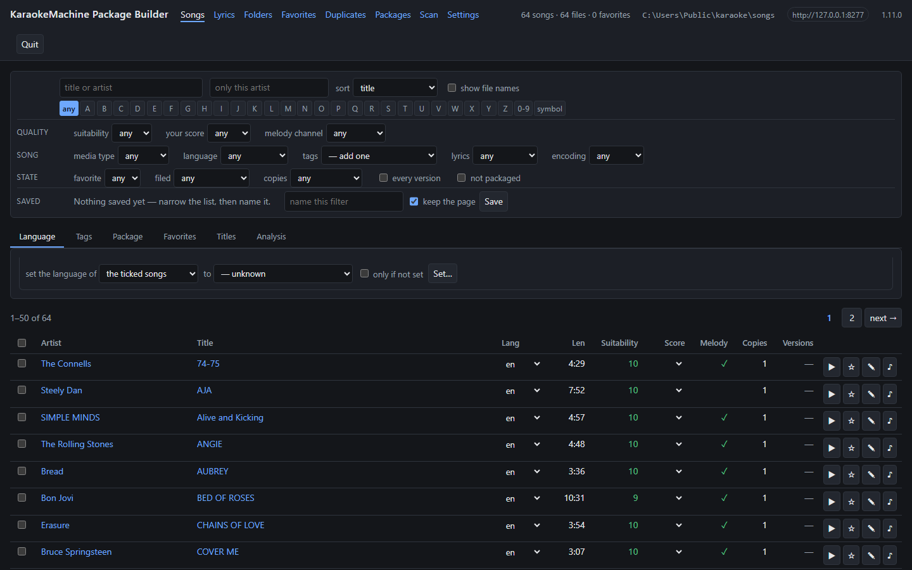

# Getting a corpus into shape

The machine plays songs from packages, and you make the packages. A handful of files needs one step.
A large folder of mixed quality needs curating first: find the good files, fix their names, and drop
the duplicates.

## A folder into a package, in one step

**KM Simple Package, `km-package-simple`, makes a package from a folder in one step.** It is for
songs you want on the machine without curating them first. Choose the folder, rename a song or leave
it out, and build. Each package it writes is marked *uncurated*, and the machine's package lists
show the mark.

## The tools for a large folder

| Tool | What it does |
|---|---|
| `km-package-builder` | Curates a folder, in a browser |
| `km-pack` | Builds and checks packages |
| `km-lyrics` | Shows one file's parsed timeline |
| `km-site-pack` | Downloads the song files a site links, and builds a package from them |
| `km-wallpaper-pack` | Builds a wallpaper set from pictures the lyrics stay readable over |

**KM Song Sync, `km-song-sync`, puts words on a MIDI file that has none.** Paste the words, choose
the file, and tap each word as it is sung.
[Putting words on a MIDI file](lyric-sync.md) has the rest.

## Curate the folder

`km-package-builder` is a local web server at `http://127.0.0.1:8178`. Browse the files, search the
lyrics themselves, rate, fix names, group duplicates, and pick songs into packages.

<p align="center">

<br><sub><b>km-package-builder</b>, for getting a folder of files into shape before it is packaged.</sub>
</p>

```sh
km-package-builder ./songs --init --scan --open   # the first time
km-package-builder ./songs                        # once it has a database
```

Only `--init` creates the database, so a wrong folder is an error and not an empty index.

## Build the package

Packaging takes three steps: describe the folder, edit the description, and build it.

```sh
km-pack spec ./songs --out vol1.kmspec.yaml     # what is here, and what it is called
km-pack spec ./songs --out vol1.kmspec.yaml --min-suitability 6 --require-lyrics   # ...or be choosier
km-pack build vol1.kmspec.yaml                  # build what the description says
km-pack check vol1.kmpkg                        # validate + report suitability
```

`build` takes a description and never a folder. `km-pack` refuses a folder of more than 999 songs.
Split the folder, or narrow it with the flags.

## Look inside one file

When a song does not behave, `km-lyrics` prints its parsed lyric timeline and its analysis.

```sh
km-lyrics dump ./song.kar
```

## Take the songs a site links

`km-site-pack` downloads a site's song files into a folder. It then builds a package from the ones
that have words.

```sh
km-site-pack <address> ./songs --dry-run        # list what a run would download
km-site-pack <address> ./songs                  # download, then build the package beside ./songs
```

It honours the site's `robots.txt` and waits between requests. Whether you may keep the files is
yours to judge.
