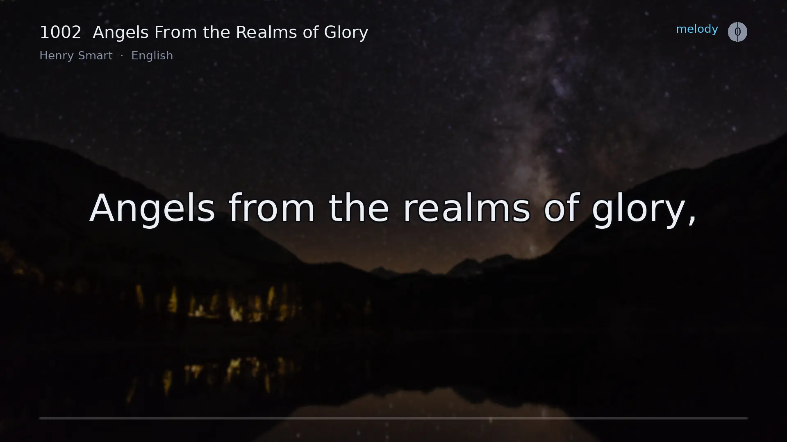
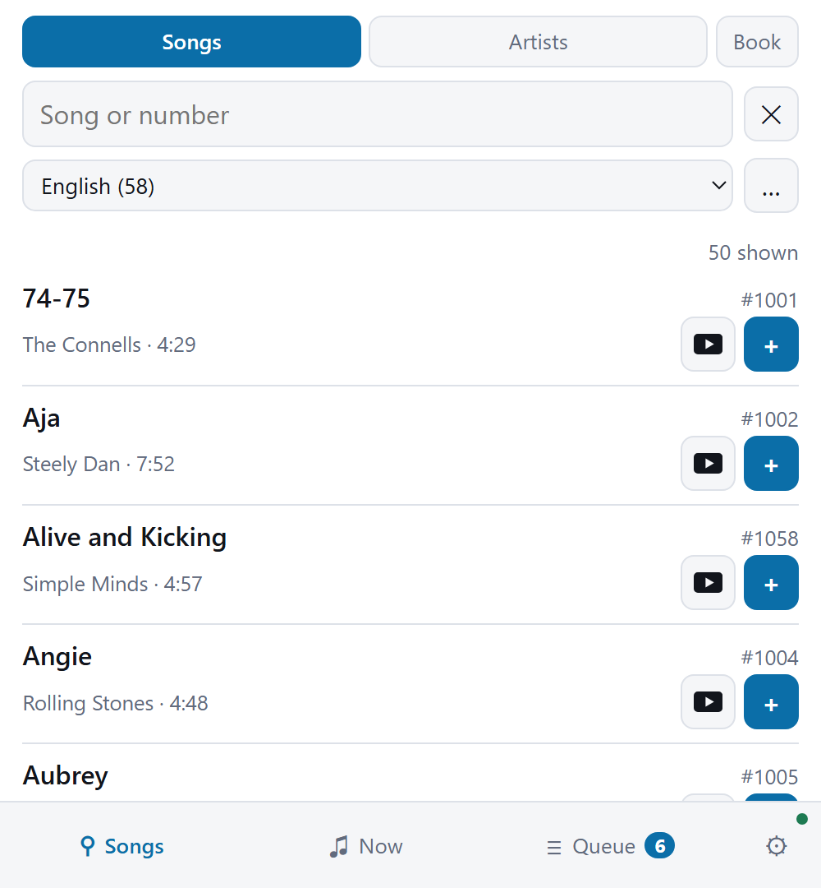
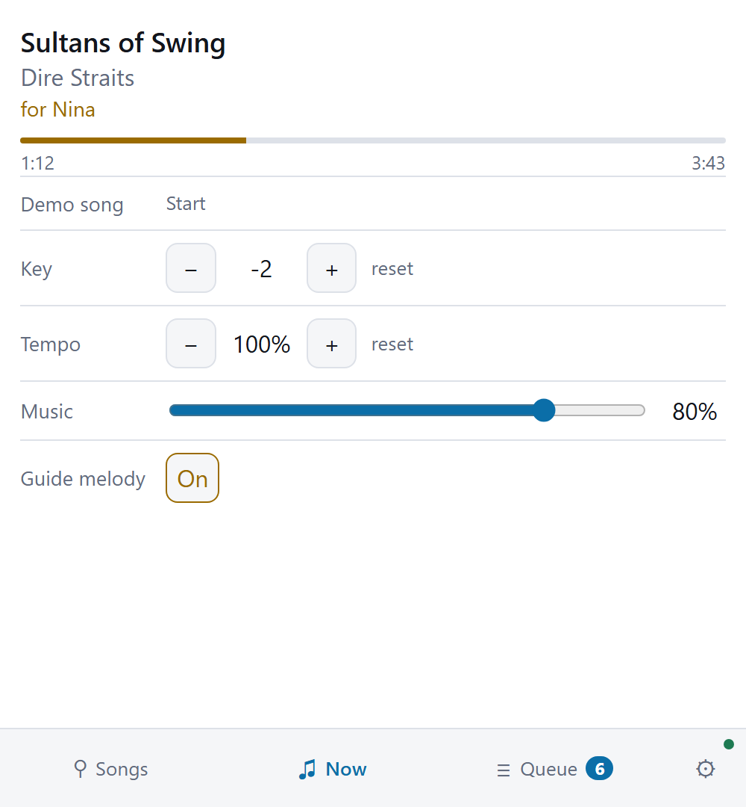
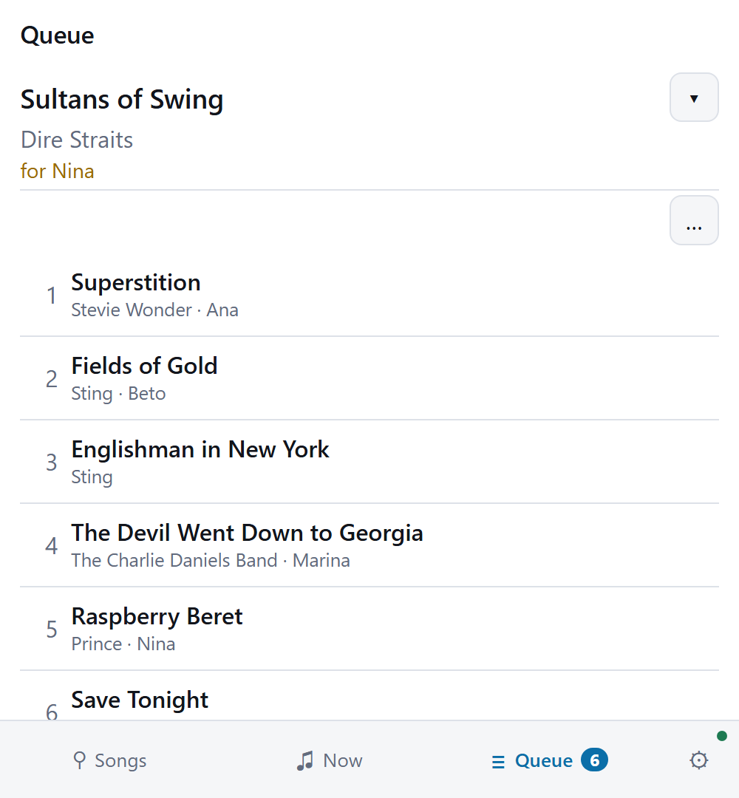
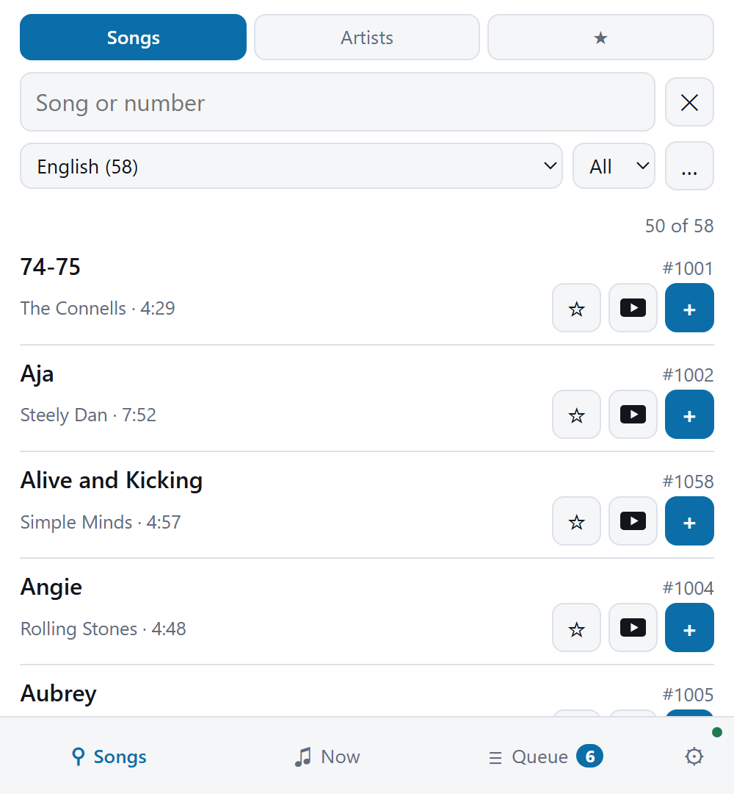
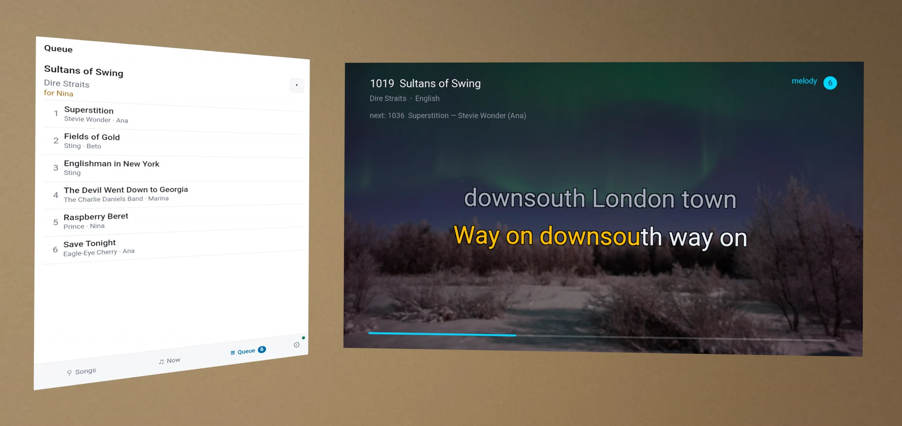

# What it looks like

<table>
<tr>
<td width="50%"></td>
<td width="50%"></td>
</tr>
<tr>
<td><b>Idle.</b> Type a number, or point a phone at the code.</td>
<td><b>The queue.</b> What is waiting, and who asked for it.</td>
</tr>
</table>

<b>Singing.</b> Each syllable fills in time with the music, and the next line is already
waiting.

<table>
<tr>
<td width="25%"></td>
<td width="25%"></td>
<td width="25%"></td>
<td width="25%"></td>
</tr>
<tr>
<td><b>Search and queue</b> from any phone. No app to install.</td>
<td><b>The song as it plays</b> — key, tempo, guide melody, music volume.</td>
<td><b>Who is up next</b>, changeable by anyone with the skip level. The controls stay
folded until asked for.</td>
<td><b>The offline remote</b> adds favorites and an A–Z picker, and works with the machine
switched off.</td>
</tr>
</table>

<b>In a headset</b>, the screen hangs on your wall and the queue hangs beside it.
